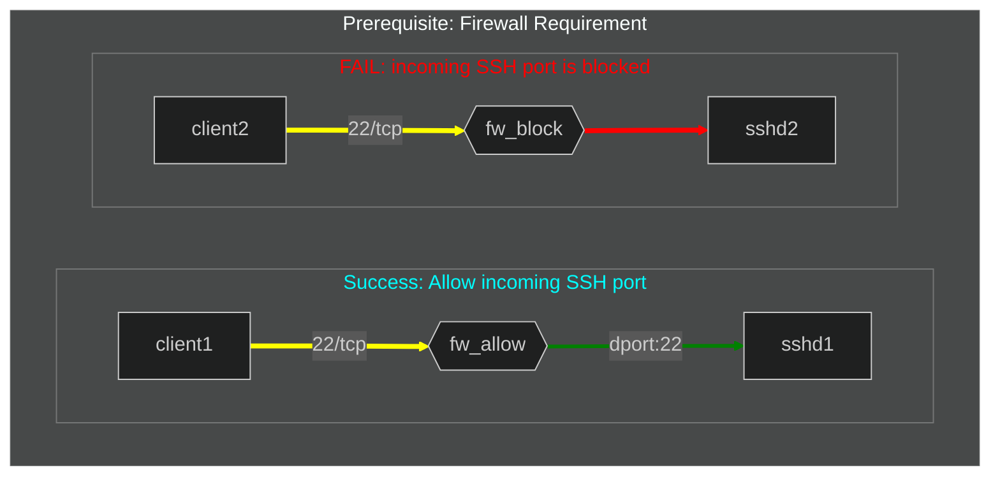
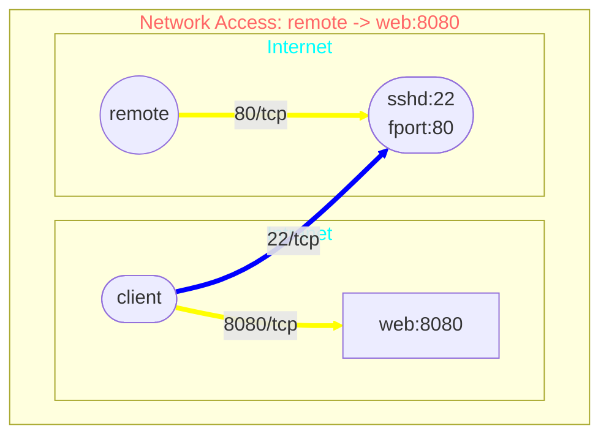

## SSH Local Port Forwarding

SSH local port forwarding allows you to securely access a service running on a remote server through an encrypted SSH tunnel.




## SSH Remote Port Forwarding

SSH remote port forwarding allows a remote server to access a service running on local machine/network through an encrypted SSH tunnel.



## SSH Dynamic Port Forwarding

```mermaid

```
