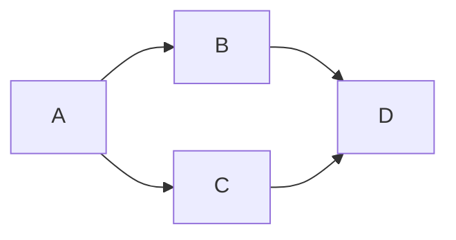
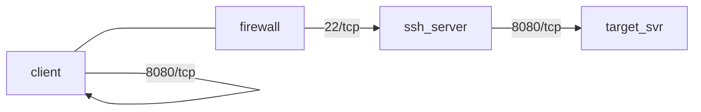

## Diagrams

```mermaid
  graph LR;
      A-->B;
      A-->C;
      B-->D;
      C-->D;
```

```mermaid
graph LR
    A[Start] --> B[Process 1]
    B --> C[Process 2]
    C --> D[End]
```

```mermaid
graph LR
    A[client] -- 8080/tcp --> A[client]
    A[client] ---- B[firewall] -- 22/tcp --> C[ssh_server]
    C -- 8080/tcp --> D[target_svr]

```
