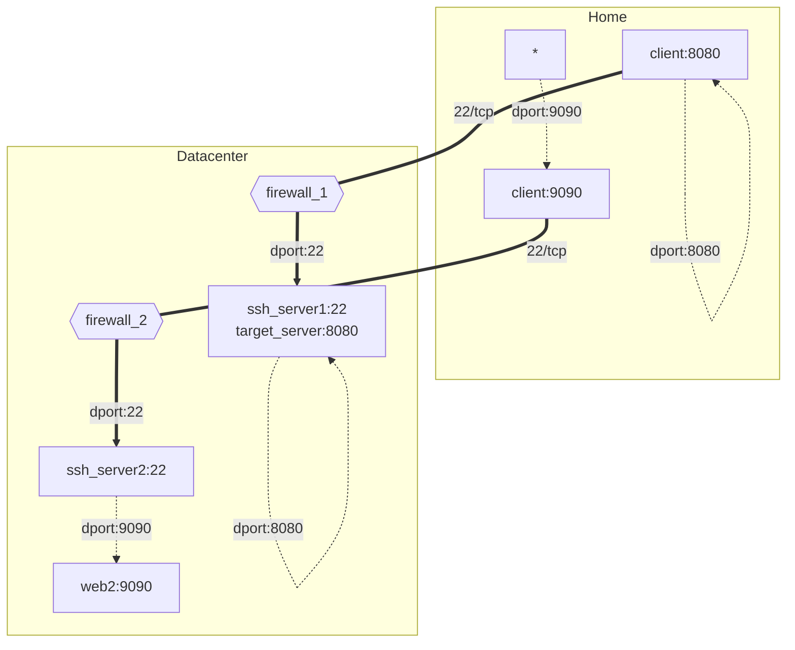

## Diagrams

## SSH Local Port Forwarding

SSH local port forwarding allows you to securely access a service running on a remote server through an encrypted SSH tunnel.

## SSH Remote Port Forwarding

SSH remote port forwarding allows you to access a service running on your local machine from a remote server through an encrypted SSH tunnel.

