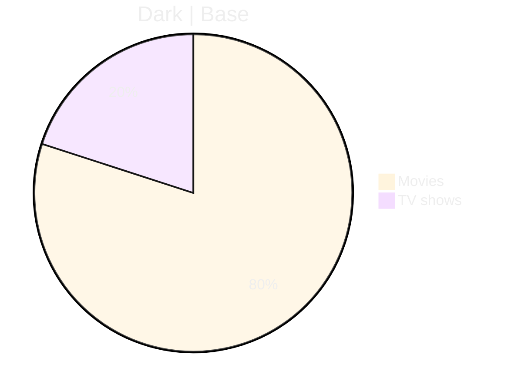
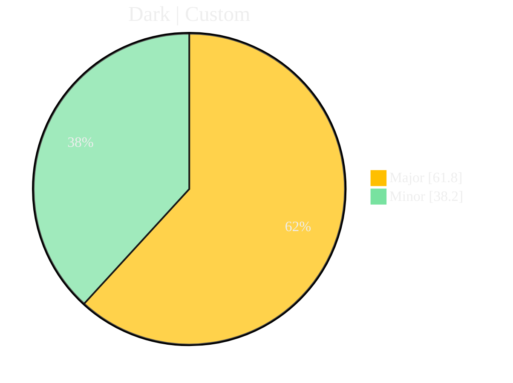

# Pie Chart Samples

| Theme    | Description |
| :----    |  :--------- |
| `base`    |  Designed to be modified, as the name implies it is supposed to be used as the base for making custom themes. |
| `forest`  |  A theme full of light greens that is easy on the eyes. |
| `dark`    |  A theme that would go well with other dark-colored elements. |
| `default` |  The default theme for all diagrams. |
| `neutral` |  The theme to be used for black and white printing. |

### Dark Base Theme

### Dark Custom Theme

